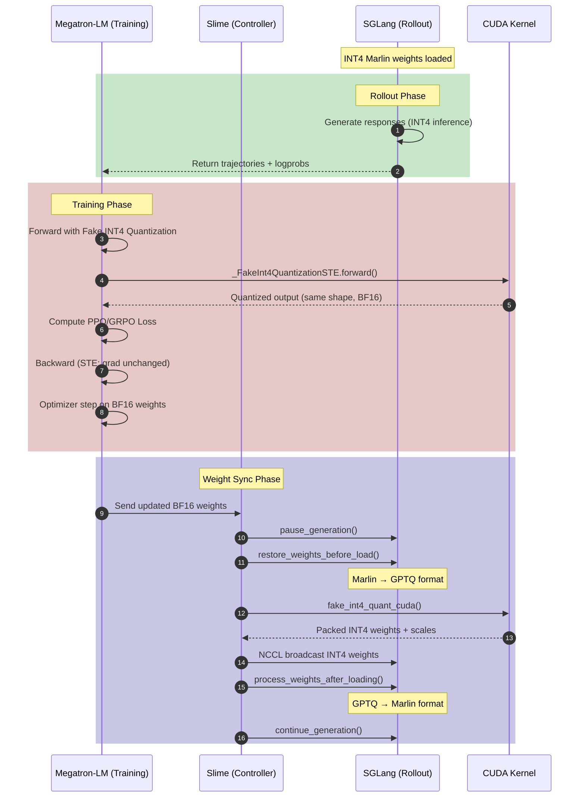
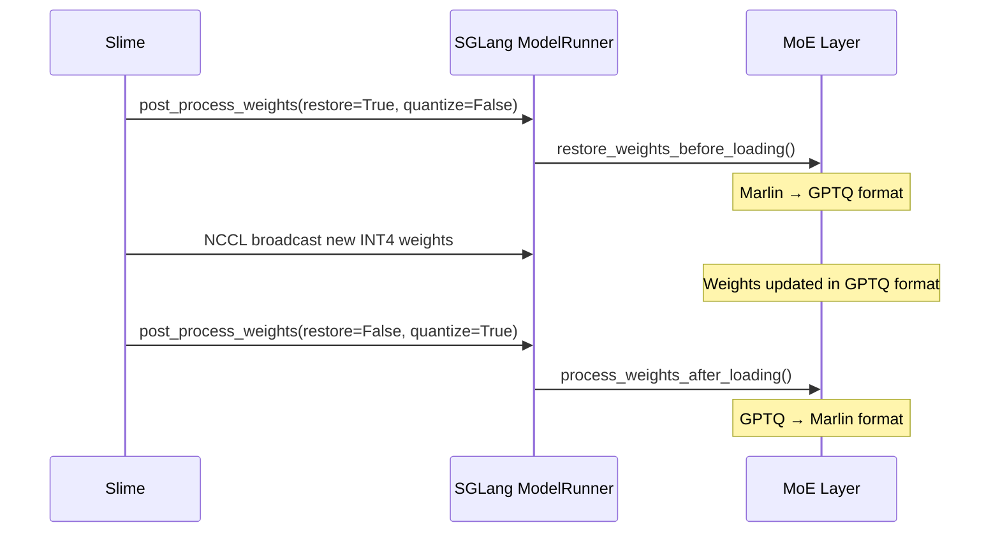

# Code Walkthrough of INT4 QAT Training Pipeline

[English](int4-qat.md)

INT4 Quantization-Aware Training (QAT) is one of the most powerful features in Slime, enabling significant inference speedup during RL rollout while maintaining training quality. This document provides an in-depth code walkthrough of the INT4 QAT pipeline.

# Start from Example

Let's start learning the INT4 QAT workflow with a launch script (`scripts/low_precision/run-moonlight-16B-A3B-int4.sh`):

```
┌─────────────────────────────────────────────────────────────────────────────────┐
│                          INT4 QAT Architecture Overview                          │
├─────────────────────────────────────────────────────────────────────────────────┤
│                                                                                  │
│   ┌────────────────────────┐         ┌────────────────────────┐                 │
│   │      Megatron-LM       │         │        SGLang          │                 │
│   │   (Training Engine)    │         │   (Rollout Engine)     │                 │
│   │                        │         │                        │                 │
│   │  ┌──────────────────┐  │         │  ┌──────────────────┐  │                 │
│   │  │   BF16 Weights   │  │         │  │  INT4 Weights    │  │                 │
│   │  │        │         │  │         │  │  (Marlin Format) │  │                 │
│   │  │        ▼         │  │         │  │        │         │  │                 │
│   │  │  Fake INT4 QAT   │  │  sync   │  │        ▼         │  │                 │
│   │  │   (STE Grad)     │──┼────────►│  │  Marlin Kernel   │  │                 │
│   │  │        │         │  │         │  │  (Fast Infer)    │  │                 │
│   │  │        ▼         │  │         │  └──────────────────┘  │                 │
│   │  │  Gradient Update │  │         │                        │                 │
│   │  └──────────────────┘  │         │                        │                 │
│   └────────────────────────┘         └────────────────────────┘                 │
│              │                                    │                              │
│              │         ┌──────────────┐          │                              │
│              └────────►│    Slime     │◄─────────┘                              │
│                        │ (Controller) │                                         │
│                        │              │                                         │
│                        │ • Quantize   │                                         │
│                        │ • Convert    │                                         │
│                        │ • Broadcast  │                                         │
│                        └──────────────┘                                         │
└─────────────────────────────────────────────────────────────────────────────────┘
```

<details>
<summary>Key Configuration in run-moonlight-16B-A3B-int4.sh</summary>

```bash
# The magic happens through these environment variables
RUNTIME_ENV_JSON="{
  \"env_vars\": {
    \"PYTHONPATH\": \"/root/Megatron-LM/\",
    \"CUDA_DEVICE_MAX_CONNECTIONS\": \"1\",
    \"OPEN_TRAINING_INT4_FAKE_QAT_FLAG\": \"1\",      # Enable fake quantization
    \"OPEN_TRAINING_INT4_GROUP_SIZE\": \"128\"        # Quantization group size
  }
}"

# Checkpoints: Note the INT4 HF checkpoint for rollout
CKPT_ARGS=(
   --hf-checkpoint /root/Moonlight-16B-A3B-Instruct-INT4   # INT4 for SGLang
   --ref-load /root/Moonlight-16B-A3B-Instruct-INT4_torch_dist
   --load /root/Moonlight-16B-A3B_slime/                    # BF16 for Megatron
   --save /root/Moonlight-16B-A3B_slime/
)
```
</details>

The two critical environment variables that enable INT4 QAT are:
- **`OPEN_TRAINING_INT4_FAKE_QAT_FLAG="1"`**: Activates fake quantization in Megatron-LM's forward pass
- **`OPEN_TRAINING_INT4_GROUP_SIZE="128"`**: Sets the group size for block-wise quantization (128 for most models, 32 for Kimi-K2)

> [!TIP]
> **What is Group Size?**
>
> In block-wise (group-wise) quantization, instead of using a single scale factor for the entire tensor, we divide each row into **groups** of consecutive elements, and each group gets its own scale factor.
>
> ```
> Weight Row (4096 elements, group_size=128):
> ┌─────────────┬─────────────┬─────────────┬─────────────┬─────┐
> │  Group 0    │  Group 1    │  Group 2    │  Group 3    │ ... │  (32 groups total)
> │ 128 elements│ 128 elements│ 128 elements│ 128 elements│     │
> │  scale_0    │  scale_1    │  scale_2    │  scale_3    │     │
> └─────────────┴─────────────┴─────────────┴─────────────┴─────┘
> ```
>
> **Why group-wise instead of per-tensor?**
> - Per-tensor: 1 scale for entire matrix → poor accuracy (outliers dominate)
> - Per-channel: 1 scale per row → better, but still coarse
> - **Group-wise**: 1 scale per N elements → fine-grained, balances accuracy vs. storage
>
> **Trade-off:**
> - Smaller group (32): More scales → better accuracy, more memory overhead
> - Larger group (128): Fewer scales → less overhead, potentially worse accuracy
>
> Kimi-K2 uses group_size=32 because its weight distribution benefits from finer-grained quantization.

> [!TIP]
> **Why "Fake" Quantization?**
>
> In QAT, we don't actually store INT4 weights during training. Instead, we:
> 1. Keep BF16 master weights for gradient updates
> 2. Simulate INT4 quantization in forward pass (quantize → dequantize)
> 3. Use Straight-Through Estimator (STE) to pass gradients unchanged
>
> This allows the model to "learn" to be robust to quantization noise while maintaining full-precision gradient updates.

# The INT4 QAT Data Flow

The figure below shows the complete data flow during one training step:



# Megatron-LM: Fake INT4 Quantization

The core of INT4 QAT lies in the `_FakeInt4QuantizationSTE` class, which implements Straight-Through Estimator for INT4 quantization. This class is injected into Megatron-LM via the patch file `docker/patch/latest/megatron.patch`.

## The STE Autograd Function

Let's walk through `_FakeInt4QuantizationSTE` step by step:

<details>
<summary>_FakeInt4QuantizationSTE Implementation (megatron/core/extensions/transformer_engine.py)</summary>

```python
class _FakeInt4QuantizationSTE(torch.autograd.Function):
    """
    Straight-Through Estimator for INT4 quantization.

    Forward: Simulates INT4 quantization (quantize → dequantize)
    Backward: Passes gradients unchanged (identity function)
    """

    @staticmethod
    def forward(ctx, x, group_size):
        m, n = x.shape
        block_size_m, block_size_n = 1, group_size

        # Step 1: Pad to align with group boundaries
        m_padded = ceil_div(m, block_size_m) * block_size_m
        n_padded = ceil_div(n, block_size_n) * block_size_n

        x_padded = torch.zeros(
            (m_padded, n_padded),
            dtype=x.dtype, device=x.device
        )
        x_padded[:m, :n] = x

        # Step 2: Reshape for group-wise operations
        # Shape: [m, n/group_size, group_size]
        x_view = x_padded.view(
            m_padded // block_size_m,
            block_size_m,
            n_padded // block_size_n,
            block_size_n
        )

        # Step 3: Compute per-group scale (symmetric quantization)
        # Find max absolute value in each group
        x_max = x_view.abs().float().amax(dim=(1, 3), keepdim=True)
        q_max = 7  # INT4 symmetric range: [-7, 7]
        x_scale = x_max / q_max
        x_scale = x_scale.clamp(min=1e-5)  # Avoid division by zero

        # Step 4: Quantize (round to nearest integer)
        x_div = x_view / x_scale
        x_round = torch.round(x_div)
        x_q_clamped = x_round.clamp(-q_max, q_max)

        # Step 5: Dequantize (restore to original scale)
        x_dequant_view = x_q_clamped * x_scale

        # Step 6: Remove padding and return
        x_dequant_full = x_dequant_view.view_as(x_padded)
        x_out = x_dequant_full[:m, :n].contiguous().to(x.dtype)

        return x_out

    @staticmethod
    def backward(ctx, grad_output):
        # STE: Gradients pass through unchanged
        return grad_output, None
```
</details>

Let me annotate the key steps in the forward pass:

| Step | Operation | Purpose |
|------|-----------|---------|
| 1 | Padding | Align tensor dimensions to group_size boundaries |
| 2 | Reshape | Group elements for per-group scale computation |
| 3 | Compute scale | `scale = max(abs(x)) / 7` for each group |
| 4 | Quantize | `x_q = round(x / scale)`, clamp to [-7, 7] |
| 5 | Dequantize | `x_out = x_q * scale` (simulate quantization error) |
| 6 | Unpad | Remove padding to restore original shape |

> [!TIP]
> **Why Symmetric Quantization?**
>
> INT4 symmetric quantization maps values to [-7, 7] (not [-8, 7]) because:
> - Simpler: No zero-point needed, just scale
> - Efficient: Works well with Marlin kernel on inference side
> - The formula `scale = max|x| / 7` ensures the range is fully utilized

## Integration Point: TEGroupedLinear

The fake quantization is injected into Megatron's `TEGroupedLinear` (used in MoE layers) through the `_get_weight_tensors` method:

<details>
<summary>TEGroupedLinear._get_weight_tensors() Modification</summary>

```python
def _get_weight_tensors(self):
    """Get the weight tensors of the module."""
    # Get original BF16 weights
    weight_tensors = super()._get_weight_tensors()

    # Apply fake quantization if enabled
    if os.getenv("OPEN_TRAINING_INT4_FAKE_QAT_FLAG", "0") == "1":
        group_size = int(os.getenv("OPEN_TRAINING_INT4_GROUP_SIZE", "128"))

        weight_tensors = [
            fake_int4_quantization_ste(w, group_size)
            for w in weight_tensors
        ]

    return weight_tensors
```
</details>

This design is elegant because:
1. **Non-invasive**: Only modifies the weight getter, not the entire forward pass
2. **Configurable**: Controlled by environment variables, easy to toggle
3. **Targeted**: Only applies to MoE expert weights (where quantization matters most)

# Slime: Weight Synchronization Pipeline

After training completes a step, Slime orchestrates weight synchronization from Megatron to SGLang. This involves three key classes:

```
┌─────────────────────────────────────────────────────────────────────────────┐
│                        Weight Sync Class Hierarchy                          │
├─────────────────────────────────────────────────────────────────────────────┤
│                                                                             │
│  ┌─────────────────────────────┐                                           │
│  │  UpdateWeightFromDistributed │ ◄── NCCL-based sync for distributed      │
│  │  (update_weight_from_        │     training setup                        │
│  │   distributed.py)            │                                           │
│  └──────────────┬──────────────┘                                           │
│                 │                                                           │
│                 │ uses                                                      │
│                 ▼                                                           │
│  ┌─────────────────────────────┐     ┌─────────────────────────────┐       │
│  │     convert_to_hf()         │────►│ quantize_params_compressed_ │       │
│  │  (megatron_to_hf/__init__)  │     │ tensors()                   │       │
│  │                             │     │ (quantizer_compressed_      │       │
│  │  • Megatron → HF naming     │     │  tensors.py)                │       │
│  │  • Tensor reshaping         │     │                             │       │
│  └─────────────────────────────┘     │  • BF16 → INT4 packing      │       │
│                                      │  • Scale computation        │       │
│                                      └──────────────┬──────────────┘       │
│                                                     │                       │
│                                                     │ calls                 │
│                                                     ▼                       │
│                                      ┌─────────────────────────────┐       │
│                                      │  fake_int4_quant_cuda       │       │
│                                      │  (CUDA Kernel)              │       │
│                                      │                             │       │
│                                      │  • High-perf quantization   │       │
│                                      │  • Warp-level reduction     │       │
│                                      └─────────────────────────────┘       │
│                                                                             │
└─────────────────────────────────────────────────────────────────────────────┘
```

## UpdateWeightFromDistributed

This class manages the end-to-end weight sync process. Let's trace through its `update_weights()` method:

<details>
<summary>UpdateWeightFromDistributed.update_weights() (slime/backends/megatron_utils/update_weight/update_weight_from_distributed.py)</summary>

```python
@torch.no_grad()
def update_weights(self) -> None:
    """
    Main weight sync entry point.

    Flow: Pause → Pre-process → Sync Non-Expert → Sync Expert → Post-process → Resume
    """
    self.weight_version += 1

    # ========== Step 1: Pause SGLang and prepare for weight update ==========
    if dist.get_rank() == 0:
        ray.get([engine.pause_generation.remote() for engine in self.rollout_engines])
        ray.get([engine.flush_cache.remote() for engine in self.rollout_engines])

        # INT4 pre-process: Convert Marlin format back to GPTQ for loading
        if self.quantization_config and self.quantization_config["quant_method"] in ["compressed-tensors"]:
            post_process_weights(
                restore_weights_before_load=True,    # Marlin → GPTQ
                post_process_quantization=False,
                rollout_engines=self.rollout_engines,
            )
    dist.barrier(group=get_gloo_group())

    # ========== Step 2: Sync non-expert parameters ==========
    buffer_size = 0
    converted_named_tensors = []
    pbar = tqdm(desc=f"[{self._group_name}] Update weights", total=0) if self._is_pp_src_rank else None

    for name, param in named_params_and_buffers(self.args, self.model):
        if ".experts." in name:
            continue  # Skip expert params for now
        buffer_size = self._update_weight_from_distributed(
            name, param, converted_named_tensors, buffer_size, pbar=pbar
        )

    if converted_named_tensors:
        self._update_bucket_weights_from_distributed(converted_named_tensors, pbar=pbar)

    dist.barrier(group=get_gloo_group())

    # ========== Step 3: Sync expert parameters (MoE) ==========
    buffer_size = 0
    named_tensors = []
    for name, param in named_params_and_buffers(self.args, self.model):
        if ".experts." not in name:
            continue  # Only expert params
        buffer_size = self._update_expert_weight_from_distributed(
            name, param, named_tensors, buffer_size, pbar=pbar
        )

    if named_tensors:
        self._update_expert_bucket_weights_from_distributed(named_tensors, pbar=pbar)

    dist.barrier(group=get_gloo_group())

    # ========== Step 4: Post-process and resume ==========
    if dist.get_rank() == 0:
        # INT4 post-process: Convert GPTQ to Marlin for fast inference
        if self.quantization_config and self.quantization_config["quant_method"] in ["compressed-tensors"]:
            post_process_weights(
                restore_weights_before_load=False,
                post_process_quantization=True,    # GPTQ → Marlin
                rollout_engines=self.rollout_engines,
            )
        ray.get([engine.continue_generation.remote() for engine in self.rollout_engines])
    dist.barrier(group=get_gloo_group())
```
</details>

The method separates non-expert and expert parameters because:
- **Non-expert params**: Use Tensor Parallelism (TP) - need `all_gather` across TP group
- **Expert params**: Use Expert Parallelism (EP) - need `all_gather` across EP group

## The Conversion Pipeline

For each parameter, the conversion flows through `convert_to_hf()`:

<details>
<summary>convert_to_hf() Pipeline (slime/backends/megatron_utils/megatron_to_hf/__init__.py)</summary>

```python
def convert_to_hf(args, model_name, name, param, quantization_config=None):
    """
    Convert a single Megatron parameter to HuggingFace format.

    Args:
        args: Training arguments
        model_name: Model identifier (e.g., "qwen3moe", "deepseekv3")
        name: Megatron parameter name
        param: Parameter tensor (BF16)
        quantization_config: Optional quantization settings

    Returns:
        List of (hf_name, tensor) tuples
    """
    # Step 1: Remove vocabulary padding (Megatron pads vocab to TP-divisible size)
    param = remove_padding(name, param, args.vocab_size)

    # Step 2: Convert naming convention and tensor layout
    # Megatron: "decoder.layers.0.mlp.experts.local_experts.0.linear_fc1.weight"
    # HF:       "model.layers.0.mlp.experts.0.gate_up_proj.weight"
    converted_named_tensors = _convert_to_hf_core(args, model_name, name, param)

    # Step 3: Quantize if configured (this is where INT4 packing happens)
    return quantize_params(args, name, converted_named_tensors, quantization_config)
```
</details>

## INT4 Quantization with CUDA Kernel

The actual quantization is performed by `quantize_params_compressed_tensors()`, which calls the CUDA kernel for efficiency:

<details>
<summary>quantize_params_compressed_tensors() (slime/backends/megatron_utils/megatron_to_hf/processors/quantizer_compressed_tensors.py)</summary>

```python
def quantize_params_compressed_tensors(converted_named_params, quantization_config):
    """
    Quantize parameters to compressed-tensors INT4 format.

    Input:  List of (name, BF16_tensor) tuples
    Output: List of (name, packed_tensor) tuples with:
            - weight_packed: INT4 values packed into INT32
            - weight_scale: Per-group scale factors
            - weight_zero_point: Zero points (for asymmetric quant)
            - weight_shape: Original tensor shape
    """
    w_cfg = quantization_config["config_groups"]["group_0"]["weights"]
    group_size = w_cfg["group_size"]
    is_symmetric = w_cfg["symmetric"]
    ignore_rules = quantization_config.get("ignore", [])

    results = []
    for name, param in converted_named_params:
        # Check ignore rules (lm_head, embeddings, norms are typically not quantized)
        is_ignored = any(
            (r.startswith("re:") and re.match(r[3:], name)) or
            r == name or name.startswith(r)
            for r in ignore_rules
        )

        if is_ignored or not name.endswith(".weight") or param.dim() < 2:
            results.append((name, param))
            continue

        # ====== Core quantization logic ======
        qw, s, zp = pack_layer(param, group_size, is_symmetric)

        # Generate output names following compressed-tensors convention
        qweight_name = name.replace(".weight", ".weight_packed")
        scale_name = name.replace(".weight", ".weight_scale")
        weight_shape_name = name.replace(".weight", ".weight_shape")

        results.append((qweight_name, qw))
        results.append((scale_name, s))
        results.append((weight_shape_name, torch.tensor(param.shape, dtype=torch.int32)))

        if zp is not None:
            zp_name = name.replace(".weight", ".weight_zero_point")
            results.append((zp_name, zp))

    return results
```
</details>

The `pack_layer()` function does the heavy lifting:

<details>
<summary>pack_layer() - The Bridge to CUDA Kernel</summary>

```python
def pack_layer(weight, group_size, sym=True):
    """
    Quantize and pack a weight tensor to INT4 format.

    Args:
        weight: BF16 tensor of shape [out_features, in_features]
        group_size: Number of elements per quantization group
        sym: Use symmetric (True) or asymmetric (False) quantization

    Returns:
        packed_weight: INT32 tensor with 8 INT4 values per element
        scale: Per-group scale factors
        packed_zp: Packed zero points (None if symmetric)
    """
    # Step 1: Call CUDA kernel for quantization
    # Returns: quantized values, scales, zero_points
    w, scale, zp = fake_int4_quant_cuda.fake_int4_quant_cuda(
        weight,
        (1, group_size),  # Block size: [1, group_size] = row-wise groups
        sym
    )

    # Step 2: Reshape for group-wise processing
    w = w.view(weight.shape[0], 1, weight.shape[1] // group_size, group_size)
    scale = scale.view(weight.shape[0], 1, weight.shape[1] // group_size, 1)
    zp = zp.view(weight.shape[0], 1, weight.shape[1] // group_size, 1)

    # Step 3: Dequantize (for verification, then re-quantize)
    if sym:
        w = w * scale  # x_dequant = x_q * scale
    else:
        w = (w - zp) * scale  # x_dequant = (x_q - zp) * scale

    w = w.view(weight.shape)
    scale = scale.view(weight.shape[0], -1).contiguous()

    # Step 4: Pack zero points for asymmetric quantization
    if not sym:
        zp = zp.view(weight.shape[0], -1)
        zeros = zp.t().contiguous().to(torch.float32)
        zeros = zeros.to(dtype=torch.int32, device=w.device)
        # Pack 8 INT4 values into INT32 with interleaved order
        zeros = zeros.reshape(-1, zeros.shape[1] // 8, 8)
        new_order_map = torch.tensor([0, 4, 1, 5, 2, 6, 3, 7], device=zeros.device) * 4
        zeros = zeros << new_order_map
        packed_zp = torch.sum(zeros, dim=-1).to(torch.int32)
    else:
        zp = None
        packed_zp = None

    # Step 5: Final quantization and packing
    quantized_weight = quantize(
        x=w,
        scale=scale,
        zero_point=zp,
        dtype=torch.int8 if sym else torch.uint8,
    )
    packed_weight = pack_to_int32(quantized_weight, 4, sym=sym)

    return packed_weight, scale, packed_zp
```
</details>

# The CUDA Kernel: fake_int4_quant_cuda

The CUDA kernel is the performance-critical component. Let me walk through it with detailed annotations:

## Kernel Overview

```
┌─────────────────────────────────────────────────────────────────────────────┐
│                    INT4 Quantization CUDA Kernel                            │
├─────────────────────────────────────────────────────────────────────────────┤
│                                                                             │
│  Input: BF16 tensor [M, N]                                                  │
│  Output: Quantized values, scales, zero_points                              │
│                                                                             │
│  Kernel Variants:                                                           │
│  ┌─────────────────────┐  ┌─────────────────────┐  ┌─────────────────────┐ │
│  │ int4_quant_1x32     │  │ int4_quant_32x1     │  │ int4_quant_common   │ │
│  │ (group_size=32)     │  │ (transposed)        │  │ (general case)      │ │
│  │                     │  │                     │  │                     │ │
│  │ One row per block   │  │ One col per block   │  │ Flexible blocking   │ │
│  │ Warp reduces cols   │  │ Warp reduces rows   │  │                     │ │
│  └─────────────────────┘  └─────────────────────┘  └─────────────────────┘ │
│                                                                             │
│  All use warp-level reduction for computing min/max within groups           │
│                                                                             │
└─────────────────────────────────────────────────────────────────────────────┘
```

## Warp-Level Reduction Primitives

<details>
<summary>Warp Reduction Functions (fake_int4_quant_cuda.cu)</summary>

```cpp
// Shuffle-based warp reduction for maximum value
// Each thread in the warp shares its value with neighbors,
// progressively computing the max across all 32 threads

__device__ __forceinline__
float warpReduceMax(float val) {
    // mask=16: threads 0-15 share with 16-31, keep max
    // mask=8:  threads 0-7 share with 8-15, etc.
    // mask=4:  ...
    // mask=2:  ...
    // mask=1:  final pairwise comparison
    #pragma unroll
    for (int mask = 16; mask > 0; mask >>= 1)
        val = fmaxf(val, __shfl_xor_sync(FINAL_MASK, val, mask, 32));
    return val;
    // After 5 iterations, all threads have the warp-wide maximum
}

__device__ __forceinline__
float warpReduceMin(float val) {
    #pragma unroll
    for (int mask = 16; mask > 0; mask >>= 1)
        val = fminf(val, __shfl_xor_sync(FINAL_MASK, val, mask, 32));
    return val;
}
```
</details>

> [!TIP]
> **Why Warp-Level Reduction?**
>
> - A warp is 32 threads that execute in lockstep (SIMT)
> - `__shfl_xor_sync` allows threads to exchange values without shared memory
> - This is perfect for group_size=32: one warp handles one group
> - Much faster than shared memory reduction for small group sizes

## The Main Quantization Kernel

<details>
<summary>int4_quant_1x32_kernel - Annotated Line by Line</summary>

```cpp
// Optimized kernel for block size [1, 32] (most common case)
// Each row is processed independently, with groups of 32 elements
template<typename scalar_t>
__global__
void int4_quant_1x32_kernel(
    const scalar_t* __restrict__ x,      // Input tensor [M, N]
    scalar_t* __restrict__ out,          // Output quantized values [M, N]
    scalar_t* out_scale,                 // Per-group scales [M, N/32]
    scalar_t* out_zero,                  // Per-group zero points [M, N/32]
    const int M, const int N,            // Tensor dimensions
    const int stride_xm, const int stride_xn,    // Input strides
    const int stride_om, const int stride_on,    // Output strides
    const int stride_osm, const int stride_osn,  // Scale strides
    const int stride_ozm, const int stride_ozn,  // Zero point strides
    bool sym                             // Symmetric or asymmetric quantization
) {
    // ========== Thread/Block Configuration ==========
    constexpr int WARPS_PER_BLOCK = 8;   // 8 warps = 256 threads per block
    const int needed_warps = ceil_div(N, 32);  // Groups needed per row

    const int tid = threadIdx.x;          // Thread ID within block [0, 255]
    const int warp_id = tid >> 5;         // Warp ID [0, 7]
    const int lane_id = tid & 0x1F;       // Lane within warp [0, 31]

    // Quantization constants
    constexpr float SYM_CONS = 1.0f / 7.0f;   // 1/q_max for symmetric
    constexpr float ASYM_CONS = 1.0f / 15.0f; // 1/q_max for asymmetric

    // Each block processes one row
    const int row = blockIdx.x;

    // ========== Process Groups ==========
    // Each warp handles one group of 32 elements
    // Multiple warps in parallel for wide rows
    for (int item = warp_id; item < needed_warps; item += WARPS_PER_BLOCK) {
        const int col = item * 32 + lane_id;  // Global column index
        float val = 0.0f;

        // Load value (with bounds check)
        if (col < N) {
            val = static_cast<float>(x[row * stride_xm + col * stride_xn]);
        }

        float scale = 0.0f;
        float zero = 0.0f;

        if (sym) {
            // ========== Symmetric Quantization ==========
            // Range: [-7, 7], scale = max|x| / 7

            float abs_val = fabsf(val);

            // All 32 threads in warp compute max together
            float block_max = warpReduceMax(abs_val);

            // Compute scale with minimum threshold
            scale = fmaxf(block_max * SYM_CONS, 1e-5f);

            // Quantize: round(x / scale)
            val = rintf(val / scale);
            // Note: clamping to [-7, 7] is implicit because
            // scale guarantees max|x|/scale = 7
        } else {
            // ========== Asymmetric Quantization ==========
            // Range: [0, 15], needs both scale and zero_point

            // Find min and max across the group
            float block_min = warpReduceMin(val);
            float block_max = warpReduceMax(val);

            // scale = (max - min) / 15
            scale = fmaxf((block_max - block_min) * ASYM_CONS, 1e-5f);

            // zero_point = -round(min / scale), clamped to [0, 15]
            zero = fminf(fmaxf(-rintf(block_min / scale), 0.0f), 15.0f);

            // Quantize: round(x / scale) + zero
            val = rintf(val / scale) + zero;
        }

        // ========== Store Results ==========
        if (col < N) {
            out[row * stride_om + col * stride_on] = static_cast<scalar_t>(val);
            // Only one thread per group writes scale/zero
            // All threads have the same value after warp reduction
            out_scale[row * stride_osm + item * stride_osn] = static_cast<scalar_t>(scale);
            if(!sym) {
                out_zero[row * stride_ozm + item * stride_ozn] = static_cast<scalar_t>(zero);
            }
        }
    }
}
```
</details>

## INT4 Packing Format

After quantization, values are packed into INT32 for efficient storage:

<details>
<summary>pack_to_int32() - Python Implementation</summary>

```python
def pack_to_int32(value, num_bits, packed_dim=1, sym=False):
    """
    Pack INT4 values into INT32 (8 values per INT32).

    Layout: [v0, v1, v2, v3, v4, v5, v6, v7] → single INT32
    Bit positions: v0 at bits [0:3], v1 at bits [4:7], etc.
    """
    if sym:
        # Symmetric: shift from [-7,7] to [1,15] for unsigned packing
        offset = 1 << (num_bits - 1)  # offset = 8
        value = (value + offset).to(torch.uint8)

    pack_factor = 32 // num_bits  # 8 for INT4

    # Reshape: [rows, cols] → [rows, cols/8, 8]
    rows, cols = value.shape
    padded_cols = math.ceil(cols / pack_factor) * pack_factor
    if padded_cols > cols:
        value = torch.nn.functional.pad(value, (0, padded_cols - cols))

    num_groups = padded_cols // pack_factor
    reshaped = value.view(rows, num_groups, pack_factor).to(torch.int32)

    # Shift and sum
    # bit_shifts = [0, 4, 8, 12, 16, 20, 24, 28]
    bit_shifts = torch.arange(pack_factor, dtype=torch.int32) * num_bits
    packed = (reshaped << bit_shifts).sum(dim=2, dtype=torch.int32)

    return packed
```
</details>

The interleaved packing order `[0, 4, 1, 5, 2, 6, 3, 7]` used for zero points is required by the Marlin kernel for efficient memory access patterns.

# SGLang: INT4 Inference with Marlin

On the inference side, SGLang uses the Marlin kernel for efficient INT4 MoE computation.

## Weight Format Conversion

SGLang needs to convert weights between formats:
- **GPTQ format**: Raw packed INT4 (for weight loading)
- **Marlin format**: Reordered for optimal memory access (for inference)

<details>
<summary>CompressedTensorsWNA16MoEMethod - Format Conversion</summary>

```python
class CompressedTensorsWNA16MoEMethod(CompressedTensorsMoEMethod):
    """Handles INT4 MoE quantization with Marlin kernel support."""

    def process_weights_after_loading(self, layer: torch.nn.Module) -> None:
        """Convert GPTQ → Marlin format after loading new weights."""

        # Skip if already converted (prevents double-conversion)
        if getattr(layer, "is_marlin_converted", False):
            return

        def replace_tensor(name, new_t):
            """In-place tensor replacement to avoid memory fragmentation."""
            target_attr = getattr(layer, name)

            # Save original shape for rollback
            if name not in layer._original_shapes:
                layer._original_shapes[name] = tuple(target_attr.shape)

            # Resize and copy (same buffer, different view)
            target_attr.resize_(new_t.shape)
            target_attr.copy_(new_t)
            del new_t

        # Repack weights for Marlin
        marlin_w13_qweight = gptq_marlin_moe_repack(
            layer.w13_weight_packed,
            layer.w13_g_idx_sort_indices,
            layer.w13_weight_packed.shape[1],
            layer.w13_weight_packed.shape[2],
            self.num_bits,
        )
        replace_tensor("w13_weight_packed", marlin_w13_qweight)

        # Repack scales with Marlin-specific permutation
        marlin_w13_scales = marlin_moe_permute_scales(
            layer.w13_weight_scale,
            layer.w13_weight_scale.shape[1],
            layer.w13_weight_scale.shape[2],
            self.group_size,
        )
        replace_tensor("w13_weight_scale", marlin_w13_scales)

        # ... similar for w2 weights ...

        layer.is_marlin_converted = True

    def restore_weights_before_loading(self, layer: torch.nn.Module):
        """Convert Marlin → GPTQ format before loading new weights."""

        if not hasattr(layer, "_original_shapes"):
            return

        # Resize back to original GPTQ shapes
        for name, orig_shape in layer._original_shapes.items():
            param = getattr(layer, name, None)
            if param is not None and param.shape != orig_shape:
                param.resize_(orig_shape)

        layer.is_marlin_converted = False
```
</details>

## Post-Process API

The post-process mechanism is triggered by Slime during weight sync:



<details>
<summary>ModelRunner.post_process_weights()</summary>

```python
def post_process_weights(self, recv_req):
    """
    Execute post-processing logic for model weights.
    Called by Slime during weight synchronization.
    """
    from sglang.srt.model_loader.loader import device_loading_context

    target_device = torch.device("cuda", torch.cuda.current_device())

    # Phase 1: Restore to loadable format (Marlin → GPTQ)
    if recv_req.restore_weights_before_load:
        for _, module in self.model.named_modules():
            quant_method = getattr(module, "quant_method", None)
            if quant_method is not None and hasattr(
                quant_method, "restore_weights_before_loading"
            ):
                with device_loading_context(module, target_device):
                    quant_method.restore_weights_before_loading(module)

    # Phase 2: Convert for inference (GPTQ → Marlin)
    if recv_req.post_process_quantization:
        for _, module in self.model.named_modules():
            quant_method = getattr(module, "quant_method", None)
            if quant_method is not None and hasattr(
                quant_method, "process_weights_after_loading"
            ):
                with device_loading_context(module, target_device):
                    quant_method.process_weights_after_loading(module)

    return True, "Success"
```
</details>

# Routing Replay for MoE Consistency

For MoE models, a subtle issue arises: the expert routing during training forward pass may differ from backward pass due to non-determinism. Slime provides `RoutingReplay` to ensure consistency:

<details>
<summary>RoutingReplay Class (slime/utils/routing_replay.py)</summary>

```python
class RoutingReplay:
    """
    Records and replays MoE routing decisions for training consistency.

    Problem: In MoE, top-k expert selection can be non-deterministic.
    If forward and backward use different routing, gradients are incorrect.

    Solution: Record routing in forward, replay in backward.
    """
    all_routing_replays = []  # Global registry

    def __init__(self):
        self.forward_index = 0
        self.backward_index = 0
        self.top_indices_list = []
        RoutingReplay.all_routing_replays.append(self)

    def record(self, top_indices):
        """Called during forward pass to save routing decisions."""
        # Offload to CPU pinned memory for efficiency
        buf = torch.empty_like(top_indices, device="cpu", pin_memory=True)
        buf.copy_(top_indices)
        self.top_indices_list.append(buf)

    def pop_forward(self):
        """Replay routing during forward pass (for recomputation)."""
        top_indices = self.top_indices_list[self.forward_index]
        self.forward_index += 1
        return top_indices.to(torch.cuda.current_device())

    def pop_backward(self):
        """Replay routing during backward pass."""
        top_indices = self.top_indices_list[self.backward_index]
        self.backward_index += 1
        return top_indices.to(torch.cuda.current_device())
```
</details>

The routing replay is integrated via a wrapper around the `compute_topk` function:

<details>
<summary>get_routing_replay_compute_topk() Wrapper</summary>

```python
def get_routing_replay_compute_topk(old_compute_topk):
    """
    Wraps the original topk function to intercept and replay routing.

    Environment variables control behavior:
    - ENABLE_ROUTING_REPLAY: "0" or "1"
    - ROUTING_REPLAY_STAGE: "fallthrough", "record", "replay_forward", "replay_backward"
    """
    def compute_topk(scores, topk, num_groups=None, group_topk=None):
        if os.environ.get("ENABLE_ROUTING_REPLAY", "0") == "1":
            routing_replay_stage = os.environ["ROUTING_REPLAY_STAGE"]

            if routing_replay_stage == "fallthrough":
                # Normal operation, no recording/replay
                return old_compute_topk(scores, topk, ...)

            if routing_replay_stage == "record":
                # Forward pass: compute and record
                probs, top_indices = old_compute_topk(scores, topk, ...)
                ROUTING_REPLAY.record(top_indices)

            elif routing_replay_stage == "replay_forward":
                # Recomputation forward: use recorded indices
                top_indices = ROUTING_REPLAY.pop_forward()
                probs = scores.gather(1, top_indices)

            elif routing_replay_stage == "replay_backward":
                # Backward pass: use recorded indices
                top_indices = ROUTING_REPLAY.pop_backward()
                probs = scores.gather(1, top_indices)

            return probs, top_indices
        else:
            return old_compute_topk(scores, topk, ...)

    return compute_topk
```
</details>

# Model Conversion Tool

Before training, you need to convert HuggingFace BF16 weights to INT4 format:

<details>
<summary>convert_hf_to_int4_direct.py Usage</summary>

```bash
python tools/convert_hf_to_int4_direct.py \
  --model-dir /path/to/bf16/model \
  --save-dir /path/to/int4/model \
  --group-size 128 \
  --is-symmetric true \
  --ignore-rules "re:.*lm_head.*" "re:.*norm.*" "re:.*embed.*"
```

The script:
1. Loads each safetensors shard
2. Quantizes weight tensors using the CUDA kernel
3. Packs to INT32 format
4. Saves with `quantization_config` in config.json

Default ignore rules exclude:
- `lm_head`: Language model head (output layer)
- `norm`: All normalization layers
- `embed`: Embedding layers
- `self_attn`: Self-attention (usually not quantized in MoE)
- `shared_experts`: Shared experts in some architectures
</details>

# Summary

The INT4 QAT pipeline in Slime achieves efficient low-precision training through a carefully designed three-component architecture:

| Component | Role | Key Technique |
|-----------|------|---------------|
| **Megatron-LM** | Training with fake quantization | STE gradient, env-var controlled |
| **Slime** | Weight conversion & sync | CUDA kernel, NCCL broadcast, format conversion |
| **SGLang** | INT4 inference | Marlin kernel, GPTQ↔Marlin conversion |

Key design insights:
1. **STE enables QAT**: By passing gradients unchanged, the model learns to be robust to quantization noise
2. **Format conversion is critical**: GPTQ (for loading) vs Marlin (for inference) require careful bidirectional conversion
3. **Expert/Non-expert separation**: Different parallelism strategies require separate sync paths
4. **Routing replay**: Ensures MoE gradient correctness by recording forward routing decisions
