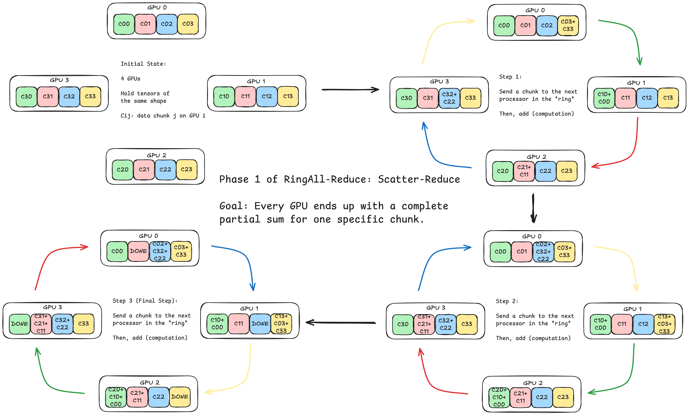
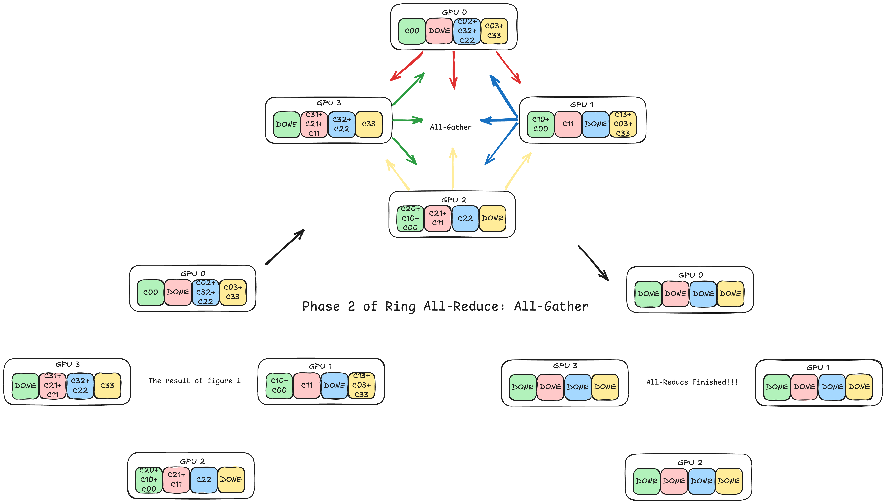

[English](en.md) | [中文](zh.md)

# Ring All-Reduce

Ring all-reduce efficiently performs all-reduce communication pattern by organizing the processors as if they look like a "ring".

> All-reduce: GPU A has data X; GPU B has data Y => Both have data X+Y (this case is reduce_sum, can also be reduce_max, min, etc).

Suppose we have four processors (GPUs) here. See figure 1. The data is first split into four chunks (same as the number of GPUs), then they are sent and received hand-over-hand in the "ring". At the end of the procedure illustrated in figure 1, each GPU has a data chunk that can serve as the final result (here is the sum).

Then, see figure 2. We just need to do one all-gather communication by letting each GPU send its result chunk to all other GPUs. After that, all GPUs will have all result data chunks, then all-reduce is done.

> All-gather: GPU A has data X; GPU B has data Y => Both have data X and Y.

Now, we can compute the communication cost of ring all-reduce.

Suppose we have P processors and the data chunk has size S in storage. Then the data is split in P chunks, each chunk has size $S/P$. In the first phase (figure 1), there are $P-1$ steps and for each step there are $P$ data chunks being sent and received. So there is $(P-1) \cdot [ (S/P) \cdot P ] = (P-1)S$ data being sent in phase 1 in total. In phase 2, each GPU sends $(P-1) \cdot (S/P)$ data and there are $P$ GPUs so there is $(P-1) \cdot [ (S/P) \cdot P ] = (P-1)S$ data being sent in phase 2 in total. The total communication cost is $2(P-1)S$, which scales linearly with the number of processors. Each GPU sends and receives $2 \cdot \frac{P-1}{P} \cdot S \approx 2S$ data, and therefore the communication pressure is distributed across GPUs in a very balanced way. This indicates a good scalability.
