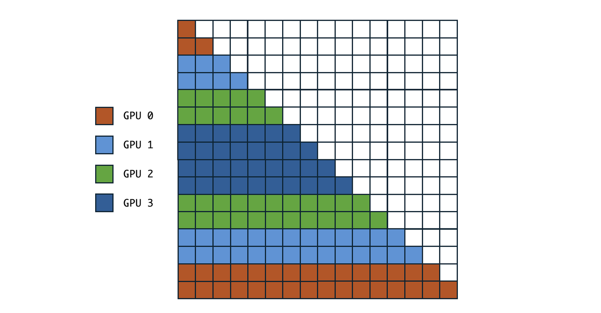

[English](en.md) | [中文](zh.md)

# Ring Flash Attention (As An Example of Context Parallelism)

The goal is to implement ring attention with the flash attention API. That is, we want to have a flash attention supporting context parallelism. This blog is based on the awesome project [ring-flash-attention](https://github.com/zhuzilin/ring-flash-attention). The author of this project wrote a [blog](https://zhuanlan.zhihu.com/p/683714620) as well but I will substantially extend it to make it more understandable (more math, code and illustrations).

## Why ring (flash) attention

1. Ring attention (will explain this later) supports dot-product attention mechanism over extremely long context without OOM (say, 1 million).
2. Want to use the efficient flash attention API in the implementation of ring attention. Just need to wrap flash attn with the communication logic!

## Ring attention forward

The implementation can be summarized in one sentence: for each step, (1) do communication (2) call flash attn API for local compute (3) update local result with online softmax.

See figure 1 for the logical procedure. Suppose we have four processors (GPUs). Initially, the sequence (which has a very long sequence length) is split into four parts (same as the number of GPUs). Each GPU is responsible for calculating the output of its local sub-sequence. KV are sent and received between GPUs. After receiving new KV, each GPU will ask the local sub-sequence query to attend to the new K and update the output accordingly. Finally, each local sub-sequence will see all KV in the **whole** sequence that it needs to compute its local output.


Now we have two key questions to answer: (1) how to update the output of local sub-sequence with the KV chunks of other sub-sequences and (2) how to use flash attention implementation.

### Answer question 1

The answer for question one is shown in the code. Now let's derive its math. Note that "lse" means "log-sum-exp".

> Code for online softmax

```python
@torch.jit.script
def _update_out_and_lse(
    out: torch.Tensor,
    lse: torch.Tensor,
    block_out: torch.Tensor,
    block_lse: torch.Tensor,
) -> Tuple[torch.Tensor, torch.Tensor]:

    block_out = block_out.to(torch.float32)
    block_lse = block_lse.transpose(-2, -1).unsqueeze(dim=-1)

    # new_lse = lse + torch.log(1 + torch.exp(block_lse - lse))
    # new_out = torch.exp(lse - new_lse) * out
    #         + torch.exp(block_lse - new_lse) * block_out
    out = out - F.sigmoid(block_lse - lse) * (out - block_out)
    lse = lse - F.logsigmoid(lse - block_lse)

    return out, lse
```

The math is:

```
(1) new_lse = lse + torch.log(1 + torch.exp(block_lse - lse))
(2) new_out = torch.exp(lse - new_lse) * out
            + torch.exp(block_lse - new_lse) * block_out

# Derive (1)
log(e^lse) + log(1+e^{block_lse-lse})
    = log(e^lse + e^block_lse)
    = log(e^new_lse)
    = new_lse

# Derive (2)
Let:
out = X / e^lse and block_out = Y / e^block_lse

And we know:
new_out = (X+Y) / e^{lse + block_lse}

So:
new_out = (out * e^lse + block_out * e^block_lse)
        / e^{lse + block_lse}
        = e^{-block_lse} * out + e^{-lse} * block_out
        = e^{lse - new_lse} * out
        + e^{block_lse - new_lse} * block_out
```

One more note. Why numerical stability can be guaranteed here? Because `block_lse` and `block_out` are both returned by the flash_attn API and thus can be deemed as numerically stable. The update math above is numerically stable. Therefore, the implementation is numerically stable.

### Answer question 2

From figure 1, we can see that at step one, we just need to turn `causal=True`, and at all following steps, we can turn `causal=False` because the query is paying attention to prefix KV blocks.

By orchestrating the `causal` parameter of the flash_attn API, for each step, we can call flash_attn one time and finish the computation.

The code is in the `ring_flash_attn_forward` func of [ring_flash_attn.py](https://github.com/zhuzilin/ring-flash-attention/blob/main/ring_flash_attn/ring_flash_attn.py):

```python
"causal": causal and step == 0
```

## Ring attention backward

Local `dQ` need to see all prefix KV blocks and local `dout`. `dK` and `dV` need to see all subsequent Q blocks, `dout`. Therefore, `dQ` can sit on the local GPU and KV should travel along the ring. Reversely, `dKV` should travel along the ring to see each local `Q` and `dout`.

To achieve this sum, the backward pass algorithm sends `dk` and `dv` buffers around the ring alongside the $K$ and $V$ blocks. At each step in the loop:

1. GPU $i$ computes the partial gradients (`block_dk_buffer`, `block_dv_buffer`).
2. It adds these newly computed partial gradients to the traveling accumulation buffers (`next_dk`, `next_dv`) it received from the previous GPU (`dk = block_dk_buffer + next_dk` and `dv = block_dv_buffer + next_dv`).
3. It sends the updated `dk` and `dv` buffers to the next GPU using `next_dk, next_dv = d_kv_comm.send_recv_kv(dk, dv)`.

See figure 2 and the code in `ring_flash_attn_backward` func of [ring_flash_attn.py](https://github.com/zhuzilin/ring-flash-attention/blob/main/ring_flash_attn/ring_flash_attn.py):


## Communication cost of naive ring flash attention

**Forward:**
Suppose K block of a sequence has storage size $S$ and there are $P$ processors (so each K block of a sub-sequence has size $S/P$). In the forward pass, there are $P$ comm steps and each GPU sends a K block and a V block ($2 \cdot S/P$). This leads to comm cost of $2S$ per GPU and $2PS$ in total.

**Backward:**
There are still $P$ comm steps and each GPU sends a K block, a V block, a dK block and a dV block ($C \cdot S/P$ where $C$ is the constant dependent on the gradient precision). This leads to comm cost of $CS$ per GPU and $CPS$ in total.

The overall communication cost scales linearly with respect to the number of GPUs and is distributed evenly across the network interconnects, indicating excellent scalability. However, in naive Ring Attention, the computational burden is heavily imbalanced due to causal masking.

## Zigzag ring attention

The naive ring attention does not allocate computation in a balanced way. As we can see, GPUs allocated with blocks in the earlier part of the sequence become idle earlier as well.

Zigzag block allocation fixes this problem. An example with 4 GPUs and 16 blocks is shown in figure 3. The four GPUs are allocated with sub-sequence id of:

$$0 \; 1 \; 14 \; 15 \mid 2 \; 3 \; 12 \; 13 \mid 4 \; 5 \; 10 \; 11 \mid 6 \; 7 \; 8 \; 9$$

This has two advantages: (1) computation allocation is more balanced and (2) still only need to call flash_attn API one time in a step by slicing the input. For instance, when KV of `0 1 14 15` goes into GPU with Q of `2 3 12 13`, the KV and Q being sent to flash_attn API will be `0 1` and `2 3 12 13` with `causal=False`.

See [here](https://github.com/zhuzilin/ring-flash-attention/tree/main?tab=readme-ov-file#performance-summary) for performance comparison.


