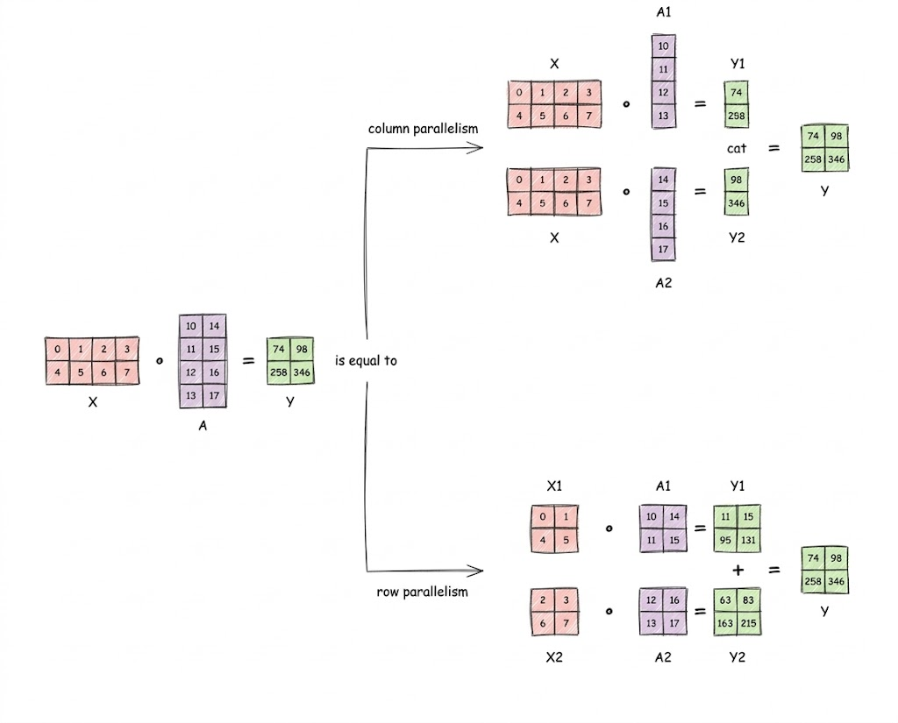
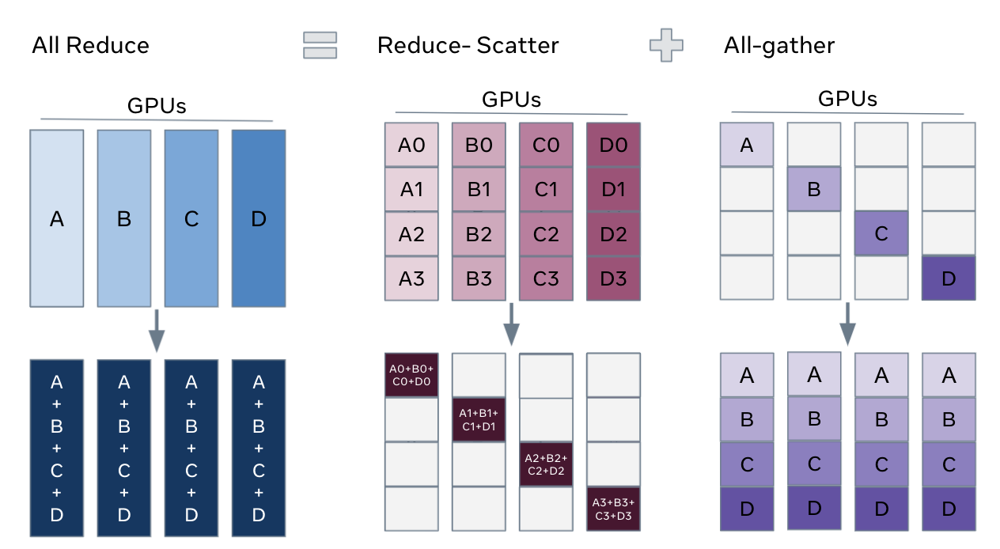

[English](en.md) | [中文](zh.md)

# 张量并行、序列并行与损失并行

读完本文，你将深入理解张量并行（Tensor Parallel）、序列并行（Sequence Parallel）和损失并行（Loss Parallel）及其在实际模型中的实现方式。

[torch.distributed 关于 TP 和 SP 的文档](https://docs.pytorch.org/tutorials/intermediate/TP_tutorial.html)写得不错但过于简洁，部分图示也容易造成困惑。我会对其进行大幅重构和扩展，在代码、图示和通信模式方面提供简明但充分的解释。

读完本文后，建议你浏览一下 pytorch 官方文档以获取具体的编程指导（例如，什么时候应该设置 `use_local_output=False`）。

## 列切分 TP 与行切分 TP

TP 将单层中的各个矩阵（张量）拆分到多个 GPU 上。见图 1。

张量并行有两种策略：行切分 TP（Row-wise TP）和列切分 TP（Column-wise TP）。区别在于**权重矩阵**是按行还是按列拆分到不同 GPU 上。见图 1 的示例。



## 在 Transformer 层中编排列切分 TP 和行切分 TP

在 torch.distributed 教程中，一个 Transformer 层以如下方式编排两种 TP：
```python
layer_tp_plan = {
    "attention.wq": ColwiseParallel(use_local_output=False),
    "attention.wk": ColwiseParallel(use_local_output=False),
    "attention.wv": ColwiseParallel(use_local_output=False),
    "attention.wo": RowwiseParallel(),
    "feed_forward.up_proj": ColwiseParallel(),
    "feed_forward.down_proj": RowwiseParallel(),
}
```


这个过程如图 2 所示（TP=2 配置）。注意，为了简洁起见，归一化、激活函数和残差连接被省略了。现在让我们分析这个过程。

### 前向和反向传播中的通信开销

可以看到，前向传播中有两次 all-reduce，反向传播中也有两次。结论是：**列切分 TP 在反向传播中产生 all-reduce，行切分 TP 在前向传播中产生 all-reduce。** 这是直观的。

- 列切分 TP 的输入在所有 GPU 上通常是相同的（来自前向 all-reduce 的结果）。因此，它分别为不同 GPU 的不同前向分支做贡献。因此，我们需要从所有分支收集并求和梯度，这就导致了反向传播中的 all-reduce。
- 行切分 TP 的输入是按列分片的。因此，每个前向分支获得输入的不同部分。所以我们需要在前向传播中合并分支（all-reduce）（见图 1），而反向传播则简单得多。

根据 [ring all-reduce 博客](/TechBlog/ring-all-reduce/)，一次 all-reduce 的通信开销约为每个 GPU $2S$，其中 $S$ 是待归约数据的存储大小。这里我们总共有四次 all-reduce，都操作一个形状为 $[N,C]$ 的张量（通常 $N = bsz \times seq\_len$，$C$ 为模型维度）。因此，总通信开销为 $4 \times 2 \times (N \times C \times byte\_per\_element)$，**每个 GPU 每层**。这是一个均衡但昂贵的开销。

### TP 如何减少每个 GPU 的内存负担

很简单。因为权重和由此产生的激活值被分片到所有 TP GPU 上。每个 GPU 的内存降低到约 $\frac{1}{\text{TP}}$。

## 在编排中加入序列并行

以下是 torch.distributed 文档对 SP 的描述。[^1]

[^1]: Sequence Parallel 建立在上文所述的 Tensor Parallel 之上。与基础的 Tensor Parallel 仅在 Attention 模块和 FeedForward 模块内部分片张量、而保持模块的输入和输出（即前向传播中的激活值和反向传播中的梯度）为副本不同，Sequence Parallel 将它们在序列维度上进行分片。

看看 torch.distributed 是如何编排 TP 和 SP 的。我会非常详细地逐步解析这段代码。不过，建议先阅读 [ring all-reduce 博客](/TechBlog/ring-all-reduce/)，或至少理解为什么 **`all_reduce = reduce_scatter + all_gather`**（图 4）。



```python
layer_tp_plan = {
    # 现在 SequenceParallel 的输入和输出具有 Shard(1) 布局，
    # 表示输入/输出张量在序列维度上进行分片
    "attention_norm": SequenceParallel(),
    "attention": PrepareModuleInput(
        input_layouts=(Shard(1), Replicate()),
        desired_input_layouts=(Replicate(), Replicate()),
    ),
    "attention.wq": ColwiseParallel(use_local_output=False),
    "attention.wk": ColwiseParallel(use_local_output=False),
    "attention.wv": ColwiseParallel(use_local_output=False),
    "attention.wo": RowwiseParallel(output_layouts=Shard(1)),
    "ffn_norm": SequenceParallel(),
    "feed_forward": PrepareModuleInput(
        input_layouts=(Shard(1),),
        desired_input_layouts=(Replicate(),),
    ),
    "feed_forward.w1": ColwiseParallel(),
    "feed_forward.w2": RowwiseParallel(output_layouts=Shard(1)),
    "feed_forward.w3": ColwiseParallel(),
}
```

首先，什么是 SP？张量（形状为 `(B,S,C)`）沿 `dim=1` 进行分片，每个 GPU 获得一个子序列块。在执行层归一化和激活函数时，每个 GPU 在其本地子序列上进行计算。这是有效的，因为归一化和激活函数对每个 token 的计算是完全独立的。

回顾 TransformerBlock 的前向传播：
```python
def forward(self, x):
    h = x + self.attention(self.attention_norm(x))
    out = h + self.feed_forward(self.ffn_norm(h))
    return out
```

我以 `"ffn_norm": SequenceParallel()` 为例来展示 TP 和 SP 的编排方式。

注意代码中 `attention.wo` 的输出布局是 `Shard(1)`。这意味着应用 `wo` 后的输出张量在序列长度维度上是分片的。根据图 2，应用 `wo` 后我们应该执行 all-reduce。现在，由于 all-reduce 可以分解为 reduce-scatter 阶段和 all-gather 阶段，而每个 GPU 在 reduce-scatter 阶段后持有子序列的部分结果，我们可以在 reduce-scatter 阶段结束时停下来，在子序列上（而非整个序列上）执行 `ffn_norm`！精妙而巧妙。

但是，之后我们仍然需要完成完整的 all-reduce（即继续执行 all-gather 阶段）。这就是以下代码块所做的事情。它告诉 torch.distributed，`ffn` 的输入当前沿 `dim=1` 分片，我们希望它是一个完整张量而非分片张量（`Replicate()`）。torch.distributed 会在将输入张量发送给 `ffn` 之前为我们执行 all-gather。
```python
"feed_forward": PrepareModuleInput(
    input_layouts=(Shard(1),),
    desired_input_layouts=(Replicate(),),
)
```

这就是 SP 和 TP 的编排方式。行切分 TP 执行 all-reduce。SP 告诉行切分 TP：在 reduce-scatter 阶段停下来，在每个 GPU 上用部分结果做一些计算，然后再执行 all-gather 来完成 all-reduce。

## 损失并行

```python
"norm": SequenceParallel(),
"output": ColwiseParallel(
    input_layouts=Shard(1),
    use_local_output=False, # 使用 DTensor 作为输出
),
```

以上是损失并行的 TP mesh。在损失并行中，不是将 logits 聚合后计算标准交叉熵，而是让 logits 保持分片在各 GPU 上（形状为 $B \times S \times \frac{V}{\text{TP}}$）。

损失并行将交叉熵分解为两个数学组件：Log-Softmax 和负对数似然（NLL）损失。

### Log-Softmax

给定 logit $x_i$，Log-Softmax 的公式为：

$$\text{LogSoftmax}(x_i) = x_i - \max(x) - \log\left(\sum \exp(x_k - \max(x))\right)$$

要计算这个，每个 GPU 需要两个全局数值：全局最大 logit（防止数值溢出）和指数和（分母）。计算技巧与 flash_attn 的 online softmax 相同。

### 负对数似然（NLL）损失

在这个阶段，我们只需找到目标词汇索引的对数似然，并在序列维度上做归约（求和）。
